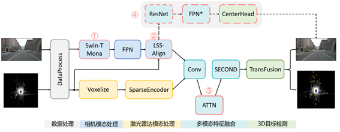

# Fusion4CA
## 1 改进工作
本项目在BEVFusion的基础上添加了4方面“CA”的改进：

1. Multi-**c**ognitive Visual **A**dapter 利用Swin-T + Mona + delta-tuning
2. **C**ontrastive **A**lignment Module 利用CAM模块实现深度特征与RGB特征的对齐
3. **C**oordinate **A**ttention Module 利用CA注意力模块优化特征分布
4. **C**amera **A**uxiliary Training Branch 利用相机辅助训练分支发掘相机分支信息

## 2 指标
在Nusc数据集上训练6轮和在Isaac Sim仿真数据集（灰色Meteor+蓝色Platform）上训练20轮的结果如下：
|Dataset| Method | mAP | NDS |
|-------| ------- | ------- | ------- |
|nuScenes|BEVFusion| 64.7   | 69.4   |
|nuScenes|Fusion4CA| 69.7   | 72.1   |
|Sim0408|Fusion4CA| 90.9   | 82.7   |


## 3 命令行指令示例
```bash
# 训练
CUDA_VISIBLE_DEVICES=2 torchpack dist-run -np 1 python tools/train.py \
configs/nuscenes/det/transfusion/secfpn/camera+lidar/swint_v0p075/convfuser.yaml \
--model.encoders.camera.backbone.init_cfg.checkpoint pretrained/swint-nuimages-pretrained.pth \
--load_from pretrained/lidar-only-det.pth \
--run-dir train_result/$(date "+%Y%m%d_%H%M%S")
# 测试
CUDA_VISIBLE_DEVICES=2 torchpack dist-run -np 1 python tools/test.py \
configs/nuscenes/det/transfusion/secfpn/camera+lidar/swint_v0p075/convfuser.yaml \
train_result/20250507_181101/best_object/map_epoch_16.pth \
--eval bbox \
--out /root/bs/502/BEVFusion-ROS-TensorRT-sim-10/bevfusion/test_result/20250507_181101/results.pkl \
--eval-options \
jsonfile_prefix=/root/bs/502/BEVFusion-ROS-TensorRT-sim-10/bevfusion/test_result/20250507_181101/
# 可视化
CUDA_VISIBLE_DEVICES=2 torchpack dist-run -np 1 python tools/visual.py \
configs/nuscenes/det/transfusion/secfpn/camera+lidar/swint_v0p075/convfuser.yaml \
train_result/20250507_181101/best_object/map_epoch_16.pth \
--output_dir vis_result/20250507_181101/ \
--with_text \
--split gt_pred
```

## 4 配置

### 4.1 config配置
1. 控制是否使用Mona模块
> 502/BEVFusion-ROS-TensorRT-sim-10/bevfusion/configs/nuscenes/det/transfusion/secfpn/camera+lidar/swint_v0p075/default.yaml
2. 控制是否使用CAM对齐模块
> 502/BEVFusion-ROS-TensorRT-sim-10/bevfusion/configs/nuscenes/det/transfusion/secfpn/camera+lidar/default.yaml
3. 控制是否使用CA注意力模块
> 502/BEVFusion-ROS-TensorRT-sim-10/bevfusion/configs/nuscenes/det/transfusion/secfpn/camera+lidar/swint_v0p075/convfuser.yaml
4. 控制是否使用相机辅助训练分支
> 502/BEVFusion-ROS-TensorRT-sim-10/bevfusion/configs/nuscenes/det/default.yaml

### 4.2 库设置
1. nuscenes-devkit的设置参考[502钉钉文档](src="https://alidocs.dingtalk.com/i/nodes/Y1OQX0akWmPX9gYnUo32vZDd8GlDd3mE")
2. mmcv设置（根据自身conda环境路径来）
```bash
A. 进入~/miniconda3/envs/bev/lib/python3.8/site-packages/mmdet/models/backbones
B. 将502/BEVFusion-ROS-TensorRT-sim-10/bevfusion/mmdet3d/models/backbones/swin_mona.py放入以上目录
C. 修改~/miniconda3/envs/bev/lib/python3.8/site-packages/mmdet/models/backbones/__init__.py 
   将SwinTransformer_mona加入进入（参考原版swin.py和SwinTransformer）
```
