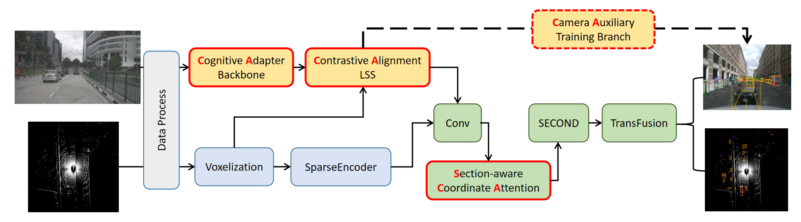
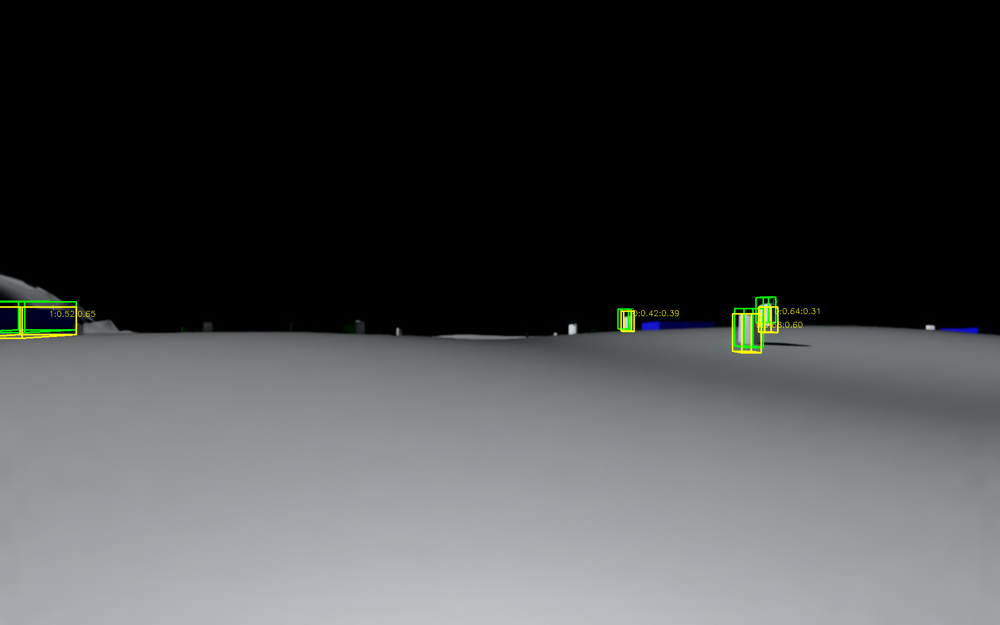
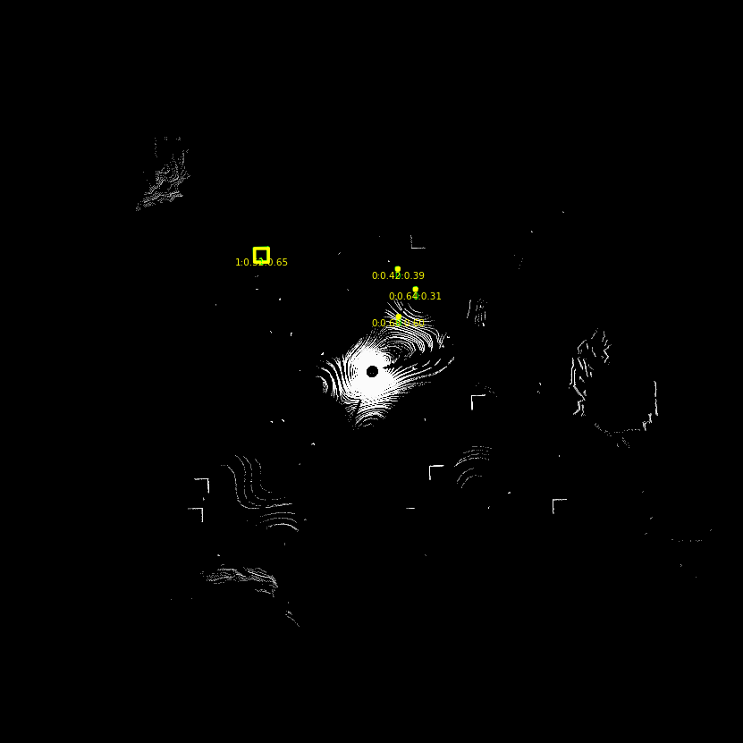

# Fusion4CA
## 1 Improvement Overview
We have made 4 "CA" improvements based on BEVFusion:

1. **C**ognitive **A**dapter-based Camera Backbone
2. **C**ontrastive **A**lignment for LSS
3. Section-aware **C**oordinate **A**ttention Module for small-object detection
4. **C**amera **A**uxiliary Training Branch

## 2 Index
6 epochs on nuScenes and 10 epochs on Sim-Lunar:

| Dataset     | Method           | mAP       | NDS       |
|-------------|------------------|-----------|-----------|
| nuScenes    | BEVFusion        | 64.7      | 69.4      |
| nuScenes    | SCAFusion        | 69.7      | 72.1      |
| Sim-Lunar   | IS-Fusion        | 71.06     | 66.92     |
| Sim-Lunar   | BEVFusion        | 79.38     | 73.34     |
| Sim-Lunar   | MV2DFusion       | 81.46     | 68.50     |
| Sim-Lunar   | **SCAFusion4CA** | **90.93** | **82.68** |






## 3 Training and Testing
```bash
# train
CUDA_VISIBLE_DEVICES=2 torchpack dist-run -np 1 python tools/train.py \
configs/nuscenes/det/transfusion/secfpn/camera+lidar/swint_v0p075/convfuser.yaml \
--model.encoders.camera.backbone.init_cfg.checkpoint pretrained/swint-nuimages-pretrained.pth \
--load_from pretrained/lidar-only-det.pth \
--run-dir train_result/$(date "+%Y%m%d_%H%M%S")
# test
CUDA_VISIBLE_DEVICES=2 torchpack dist-run -np 1 python tools/test.py \
configs/nuscenes/det/transfusion/secfpn/camera+lidar/swint_v0p075/convfuser.yaml \
train_result/20250507_181101/best_object/map_epoch_16.pth \
--eval bbox \
--out /path/to/SCAFusion/test_result/20250507_181101/results.pkl \
--eval-options \
jsonfile_prefix=/path/to/SCAFusion/test_result/20250507_181101/
# visualize
CUDA_VISIBLE_DEVICES=2 torchpack dist-run -np 1 python tools/visual.py \
configs/nuscenes/det/transfusion/secfpn/camera+lidar/swint_v0p075/convfuser.yaml \
train_result/20250507_181101/best_object/map_epoch_16.pth \
--output_dir vis_result/20250507_181101/ \
--with_text \
--split gt_pred
```

## 4 Configs

### 4.1 Environment Setup
same as [BEVFusion](https://github.com/mit-han-lab/bevfusion)

### 4.2 config files
1. Cognitive Adapter-based Camera Backbone
> /path/to/SCAFusion/configs/nuscenes/det/transfusion/secfpn/camera+lidar/swint_v0p075/default.yaml
2. Contrastive Alignment for LSS
> /path/to/SCAFusion/configs/nuscenes/det/transfusion/secfpn/camera+lidar/default.yaml
3. Section-aware Coordinate Attention Module
> /path/to/SCAFusion/configs/nuscenes/det/transfusion/secfpn/camera+lidar/swint_v0p075/convfuser.yaml
4. Camera Auxiliary Training Branch
> /path/to/SCAFusion/configs/nuscenes/det/default.yaml

### 4.3 Library Modifications
1. mmcv(based on YOUR_CONDA_FOR_SCAFusion)
```bash
A. Entering ~/miniconda3/envs/${YOUR_CONDA_FOR_SCAFusion}/lib/python3.8/site-packages/mmdet/models/backbones
B. copy /path/to/SCAFusion/mmdet3d/models/backbones/swin_mona.py into the above directory
C. add model in ~/miniconda3/envs/${YOUR_CONDA_FOR_SCAFusion}/lib/python3.8/site-packages/mmdet/models/backbones/__init__.py 
   all=['XXX']
```
